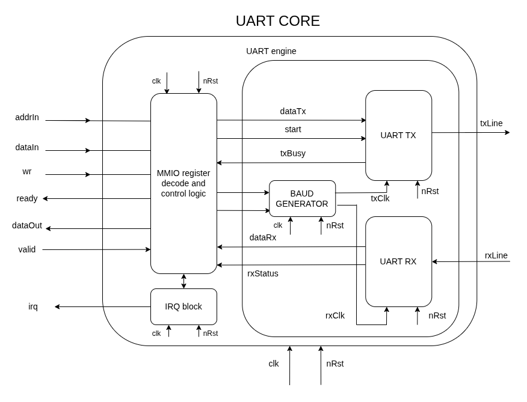
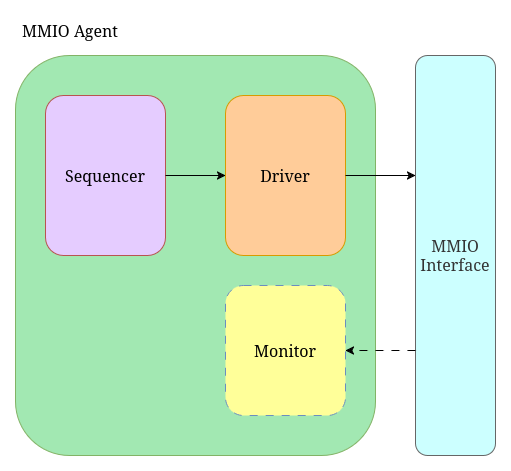
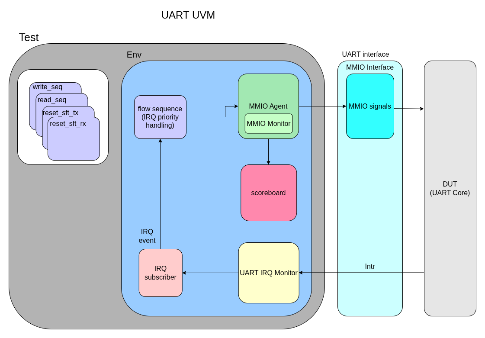
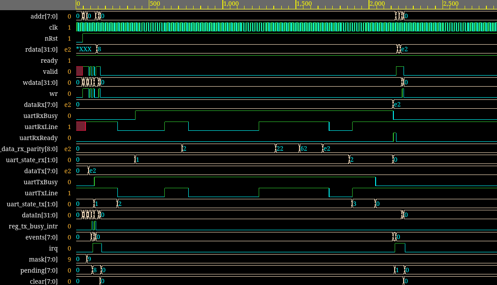

# UART Core
## Overview
This part of the SoC project implements a simple configurable UART (Universal Asynchronous Receiver Transmitter) IP core in verilog. The focus is primarily on RTL synthesizable design, well defined FSM and verification in both verilator(fast debug during RTL) and UVM(comprehensive tests).

## Features
1. Generic 8-bit transmission of data along with configurable parity(even/odd) and stop bits(1,2).
2. Configurable 16-bit integer baud generator which is used to generate baud clk for both TX and RX components of IP core with consideration of oversampling for RX.
3. Control register designed for enabling TX, RX, test mode (Used for loopback tests with RX component) and soft reset capability
4. Memory mapped register interface (MMIO) for easier integration into SoC level environments.

## Supported behaviour
1. Write requests to configuration and control registers are silently dropped (not queued and not acknowledged) while TX/RX is busy.
2. TX and RX components support independent soft reset via `UART_REG_RESET`. 
System-wide hard reset resets all UART state machines and registers to default state.
3. Write requests to control register enables TX, RX components as well as optional test mode if both TX, RX are enabled.
4. Interrupts designed (can be enabled/masked):
	- RX ready
	- RX err
	- TX busy

## Design
UART core is split into following parts:
- `uart_engine`
	- `baud_generator_int` (shared clock generator for TX and RX with oversampling)
	- `uart_tx` (TX component that handles sending bytes)
	- `uart_rx` (RX component that handles receiving bytes)
		- `uart_rx_oversampler` (oversampler does oversampling of middle 3 bits to filter out noise)
- `irq_block`(generic irq block to capture events and accumulate them, even during irq handling)

_Note: MMIO logic is generic and implemented as register decode model executions based on defined register map and access properties_

### Signal interface
|signal|width|direction|function|
|------|-----|---------|--------|
| clk | 1 | in | system uart clock |
| nRst | 1 | in | active low reset for uart |
| addrIn | 8 | in | uart memory mapped address |
| dataIn | 8 | in | uart data in |
| dataOut | 8 | out | uart data out |
| wr | 1 | in | write-read signal |
| valid | 1 | in | valid signal for mmio transaction |
| ready | 1 | out | backpressure/stall control from uart core |
| irq | 1 | out | uart interrupt |
| uartTxLine | 1 | out | uart serial out |
| uartRxLine | 1 | in | uart serial in |

UART CORE design:

  

## Register map
This is the register map defined for MMIO access and used commonly in rtl and verification environments.

| register | register address | properties | usage |
|----------|------------------|------------|-------|
| UART_REG_WRITE/UART_REG_BASE | 0x00 | w only | base alias/write register for uart TX component to send data |
| UART_REG_READ | 0x04 | r only | read register for reading data from uart RX component |
| UART_REG_CONFIG | 0x08 | w only | config register for adjusting baud rate relative to sysClk and setting other config such as stop bits and parity |
| UART_REG_CONTROL | 0x0C | w only | control register to enable/disable TX/RX and loopback test mode |
| UART_REG_RESET | 0x10 | w only | soft reset register for TX and RX|
| UART_REG_STATUS | 0x14 | r only | used by external device to poll status or read errors or busy components |
| UART_REG_INT_STATUS | 0x18 | r only | interrupt status register for listing all interrupts received |
| UART_REG_INT_MASK | 0x1C | w only | interrupt mask used by external device to enable specific interrupts |
| UART_REG_INT_PEND | 0x20 | r only | currently pending interrupts (unmasked by external device and active) |
| UART_REG_INT_CLR | 0x24 | w only | interrupt clear register after handling of interrupts (w1c-write 1 to clear) |
| UART_REG_END | 0x28 | none | reference for end of UART core register map |

### Bitmap for registers
#### UART_REG_CONFIG (MSB->LSB)
|unused|stop bits|parity|oversampling|baud generator config|
|------|---------|------|------------|---------------------|
|13|1|1|1|16|
#### UART_REG_CONTROL (MSB->LSB)
|unused|test mode(tx and rx)|rx enable|tx enable|
|------|------|------------|---------------------|
|29|1|1|1|
#### UART_REG_RESET (MSB->LSB)
|unused|rx soft reset|tx soft reset|
|------|------------|---------------------|
|30|1|1|
#### UART_REG_INT_* (MSB->LSB)
|unused|tx busy|rx err|rx ready|
|------|------|------------|---------------------|
|28|1|2|1|
#### UART_REG_STATUS (MSB->LSB)
|unused|rx ready|rx busy|tx busy|
|------|------|------------|---------------------|
|29|1|1|1|

### Planned features (Not in current release)
These features are not implemented in this release and may evolve before introduction:
1. FIFO support
2. DMA interface (high speed UART)

## Verification setup
### UVM 
UVM setup is reusable from agent perspective as the the control interface of the UART core is generic MMIO type interface with handshake. So the agent contains generic mmio driver, sequencer, transaction item and interface

MMIO Agent:

  

UVM setup:

  

This is base UVM setup with sequences available from a sequence library and extended from base sequence.

Waveform for Write and Read with IRQ handling:

  

### Tests supported
#### Write and Read IRQ test
This test performs basic loopback write and read test using the interrupt signal.
In order for this test to work the DUT should be set to loopback mode via control register,
set to have valid baud rate divisor using config register and finally rx_ready interrupt should be enabled via 
interrupt mask register
- Set config
- Set control (tx-rx loopback enabled)
- Set interrupt for rx_ready (interrupt mask)
- Start flow sequence loop (count)
	- for each iteration
		- if TX is busy the flow sequence stalls fof configured delay cycles until next TX write is performed
		to avoid TX write aliasing issue at scoreboard
		- DUT sends IRQ signals when rx loopback is received
		- IRQ monitor signals IRQ subscriber port which triggers `irq_event` signal that notifies flow sequence
		interrupt handle
		- flow sequence interrupt handles the interrupt similar to a CPU handling an interrupt
			- read interrupt status
			- decide interrupt handling based on bits set
			- read received data if rx_ready interrupt
			- clear processed interrupts (rx_read for now)