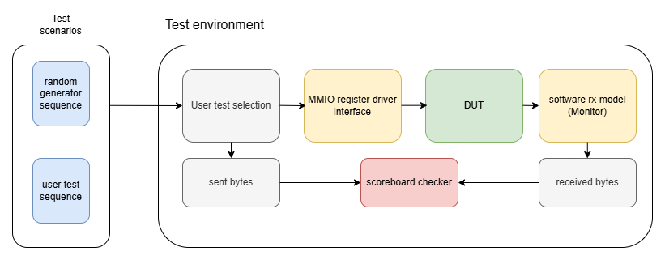
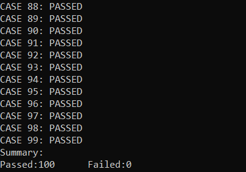
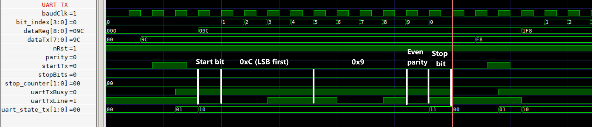
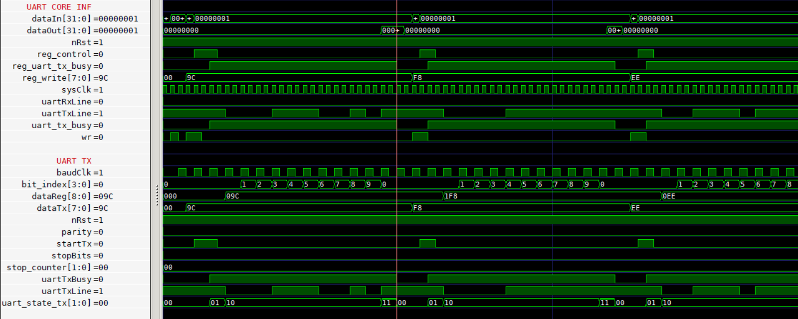

# UART Core
## Overview
This part of the SoC project implements a simple configurable UART (Universal Asynchronous Receiver Transmitter) IP core in verilog. The focus is primarily on RTL synthesizable design, well defined FSM
and verification methodology in verilator.

### Current status (Phase 1)
1. UART tx, configurable baud generator and basic MMIO (Memory mapped input output) interface implemented.
2. Clear MMIO register map definitions that provide enough abstraction to run tests as if the model is software/firmware implementation.
3. Verilator self checking testbench with UVM-inspired architecture to run unit tests on IP core with tx implemented.

### Phase 2
1. UART rx to be integrated into IP core for full duplex communication, addition of interrupts and necessary registers for access.
2. APB wrapper for existing MMIO interface to create a generic interface that can be connected at SoC level.

### Phase 3
1. UVM architecture tests for complete verification of final IP.
2. Configurable FIFO for streaming transactions.

## Features
1. Generic 8-bit transmission of data along with configurable parity(even/odd) and stop bits(1,2).
2. Configurable 16-bit integer baud generator which is used to generate baud clk for both tx and rx components of IP core with consideration of oversampling for Rx.
3. Configurable parity, stop bits, and test mode (Used for loopback tests with rx component)
4. Memory mapped register interface (MMIO)
5. Self checking verification for uart tx (verilator testbench)

## Design
UART core is split into 3 parts(4 parts if MMIO logic is considered):
- baud_generator_int (shared clock generator for tx and rx with oversampling)
- uart_tx (tx component that handles sending bytes)
- uart_rx (rx component that handles receiving bytes)

_Note: MMIO logic is generic and is implemented as registers and address mapped executions based on defined register map and access properties_

UART CORE design:
<p align="center">
  
</p>

## Register map
This is the register map defined for MMIO access and used commonly in rtl as well as verilator simulation

| register | register address | properties | usage |
|----------|------------------|------------|-------|
| UART_REG_BASE | 0xF00000000 | w only | used as base address (also the write address) |
| UART_REG_WRITE | 0xF00000000 | w only | write register for uart tx component to send data |
| UART_REG_READ | 0xF00000004 | r only | read register for reading data from uart rx component |
| UART_REG_CONTROL | 0xF00000008 | w only | control register to start tx data, stream data, and other additional operations |
| UART_REG_CONFIG | 0xF0000000C | w only | config register for adjusting baud rate relative to sysClk and setting other config such as test mode, stop bits and parity |
| UART_REG_STATUS | 0xF00000010 | r only | used by external device to poll status or read errors or busy components |
| UART_REG_END | 0xF00000014 | none | reference for end of UART core register map |

_Note: This register map is not final, as other features would be added which would add more registers depending on requirement_

## Test environment (verilator)
The testbench for tx tests is UVM-inspired and provided enough abstraction to work with MMIO and common firmware/driver type software interface.
Using verilator for early test of smaller component systems is fast and easier to test compared to UVM setup which is more suitable for generic SoC interfaces
and multi-layered components. Below is the sequence of transaction type simulation and verification that mimics smaller section of UVM for tx tests:
1. random data generator (sequencer)
2. driver (MMIO abstraction and blocking loop of UART busy state)
3. monitor (software rx that works similar to actual rx by sampling bits as middle of each bit period)
4. scoreboard (compares sent data from tx and received rx data)

Overall UVM-inspired abstraction model used for tests:
<p align="center">
  
</p>
The above test model ensures end to end validation of uart tx working with MMIO interaction from testbench/software end.

### Implementation
The abstraction of MMIO based interface is implemented in software testbench as follows:
```cpp
//Private methods
void UartCoreTxTest::writeReg(uint32_t addr,uint32_t data)
{
	m_top->addrIn=addr;
	m_top->dataIn=data;
	m_top->wr=1;
	this->tick();
	m_top->wr=0;
}

uint32_t UartCoreTxTest::readReg(uint32_t addr)
{
	m_top->addrIn=addr;
	m_top->wr=0;
	this->tick();
	return m_top->dataOut;
}
```
Read/write operations are used to write/read transaction type sequences by implementing a software driver with the following code:
```cpp
void UartCoreTxTest::setConfig(uint32_t config)
{
	while(this->readReg(UART_REG_STATUS)!=0);
	this->writeReg(UART_REG_CONFIG,config);
	m_config=config;
	P_BAUD_CYCLE=m_config&0x0000FFFF;
	m_rxMonitor.setConfig(P_BAUD_CYCLE);
}

void UartCoreTxTest::sendByte(uint8_t byte,bool stream)
{
	uint32_t data=(uint32_t) byte;
	while(this->readReg(UART_REG_STATUS)!=0);
	this->writeReg(UART_REG_WRITE,data);
	this->writeReg(UART_REG_CONTROL,1);	//send 1 for starting transmission

	if(stream)
		this->runUntilEOF();
	else
	{
		this->readReg(UART_REG_STATUS);
		this->runUntilTxFree();
	}
}
```
The above methods provide abstraction for driving values generated by a random sequence generator to toggle as pin values using verilator evaluation
model


## Tests performed
1. custom sequence (user):
```cpp
// send a custom sequence
uint32_t size=5;
uint8_t bytes[size]={0xAA,0xFF,0x3E,0x24,0x63};
test.sendBytes(bytes,size);

// compare on receiver end
test.compare();
```

2. random sequence generated from a seed
```cpp
// Send a random generated sequence (seeded)
UartCoreTxRandSeq sequenceGenerator;
sequenceGenerator.setSeed(127);
uint32_t samples=100;
test.sendBytesV(sequenceGenerator.genData(samples));

//compare on receiver end
test.compare();
```
_Note: More tests are to be added once rx is implemented and most of the test structure is moved to UVM_

## How to run
The project uses unified make system to verilate and compile testbench files under "PROJECT_ROOT/obj_dir/uart_core" where "uart\.mk" is the makefile
argument provided to do custom tests for verialator and gives full control to compile different components and cpp source files

### design or test specific build file under [build_makefiles/uart.mk](../../build_makefiles/uart.mk)
```makefile
TOP:= uart_core
DESIGN_FILES:= \
	"peripherals/uart/uart_core.v" \
	"peripherals/uart/uart_tx.v" \
	"peripherals/uart/baud_generator_int.v"

DIR_PATH:= "peripherals/uart"

# mention source files and include directly
SRC_FILES:= \
	"peripherals/uart/verilator_sim/src/uart_core_tx_tests.cpp" \
	"peripherals/uart/verilator_sim/src/uart_core_rand.cpp" \
	"peripherals/uart/verilator_sim/src/uart_core_tx_tests_main.cpp"
SRC_INCLUDES:= \
	"-Iperipherals/verilator_sim/include"
```

For verilating the design use
```shell
make MAKEFILE_INCL=uart.mk verilate
```

For building and running the testbench use
```shell
make MAKEFILE_INCL=uart.mk build
make MAKEFILE_INCL=uart.mk run
make MAKEFILE_INCL=uart.mk build-run
```

Use gtkwave to view the waveform generated by simulation under obj_dir/uart_core
```shell
gtkwave dump.vcd
```

### Scoreboard checks


### UART TX frame waveform


### UART TX frames back to back



## Conclusion
1. Results
- Successfully verified working UART Core with tx implementation and MMIO interface.
- Tested with directed and randomized sequences.
- Validated tx transmission with software rx monitor and scoreboard to verify the design.

2. Limitations
- Rx component not yet implemented.
- No interrupt support.
- No coverage metrics or assertions at this functional component test phase.
- UVM environment planned along with APB wrapper or standardized interface.

3. Design decisions
- Usage of MMIO makes the initial tests easier to debug and handle abstractions at software level, and it makes easier to write wrappers for 
interconnect protocols like AMBA, Wishbone etc.
- Verilator is used for faster component test before proceeding to total UVM test environment where reusability and analytics via coverage, constraints
and assertions verify the design completely.